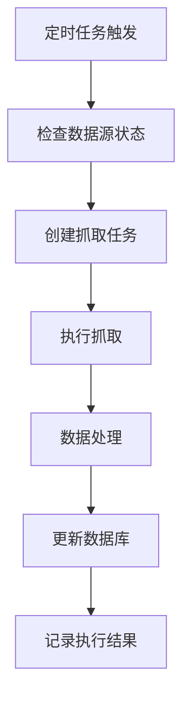
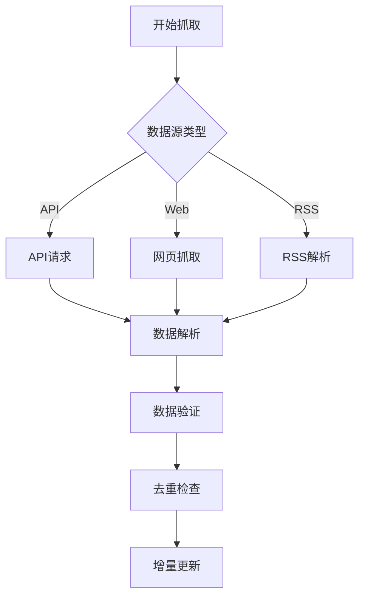

# 🤖 AI应用自动抓取系统 - 功能更新记录

## 📋 更新概览

**更新时间**: 2024年1月20日  
**更新内容**: 新增AI应用自动抓取和更新机制  
**核心价值**: 自动化数据更新 + 实时监控 + 智能调度

---

## 🎯 功能概述

### 核心定位
**"每天自动抓取全球最新AI应用，保持排行榜数据实时更新"**

### 系统架构
1. **数据源管理**: 支持多种数据源类型（API、网页、RSS）
2. **定时任务调度**: 基于Cron表达式的智能调度
3. **抓取执行引擎**: 多线程并发抓取
4. **数据更新机制**: 智能去重和增量更新
5. **监控管理界面**: 实时状态监控和手动控制

---

## 🛠️ 技术实现

### 1. 抓取引擎 (`apps/web/src/lib/ai-apps-crawler.ts`)

#### 数据源配置
```typescript
interface DataSource {
  id: string;
  name: string;
  url: string;
  type: 'api' | 'web' | 'rss' | 'manual';
  enabled: boolean;
  priority: number;
  lastFetch: Date | null;
  fetchInterval: number; // 分钟
  config: {
    apiKey?: string;
    headers?: Record<string, string>;
    selectors?: Record<string, string>;
    mapping?: Record<string, string>;
  };
}
```

#### 支持的数据源
1. **Product Hunt API** - 热门AI应用
2. **AlternativeTo** - AI应用替代方案
3. **GitHub Trending** - AI开源项目
4. **App Store** - iOS AI应用
5. **Google Play** - Android AI应用

#### 抓取功能
- **API抓取**: 支持GraphQL和REST API
- **网页抓取**: 支持CSS选择器解析
- **RSS抓取**: 支持RSS/Atom订阅
- **智能去重**: 基于应用名称和URL去重
- **增量更新**: 只更新变化的数据

### 2. 定时任务调度器 (`apps/web/src/lib/ai-apps-scheduler.ts`)

#### 任务配置
```typescript
interface ScheduledTask {
  id: string;
  name: string;
  cronExpression: string;
  sourceId?: string; // 如果为空，则抓取所有数据源
  enabled: boolean;
  lastRun?: Date;
  nextRun?: Date;
  description: string;
}
```

#### 默认定时任务
1. **每日早晨抓取** - `0 8 * * *` (每天上午8点)
2. **Product Hunt每日抓取** - `0 10 * * *` (每天上午10点)
3. **GitHub Trending抓取** - `0 */6 * * *` (每6小时)
4. **每周全量抓取** - `0 2 * * 1` (每周一凌晨2点)

#### 调度功能
- **Cron表达式解析**: 支持标准Cron语法
- **智能时间计算**: 自动计算下次执行时间
- **任务状态管理**: 运行、完成、失败状态跟踪
- **错误重试机制**: 失败任务自动重试

### 3. 管理界面 (`apps/web/src/pages/AdminAICrawlerPage.tsx`)

#### 页面功能
- **概览面板**: 统计信息、调度器状态、最近执行历史
- **数据源管理**: 查看、编辑、启用/禁用数据源
- **定时任务管理**: 添加、编辑、删除定时任务
- **执行历史**: 查看详细的抓取执行记录

#### 操作功能
- **启动/停止调度器**: 一键控制调度器状态
- **手动触发抓取**: 立即执行抓取任务
- **实时监控**: 查看任务执行状态和结果
- **错误诊断**: 详细的错误信息和处理建议

---

## 📊 数据源配置

### Product Hunt API
```typescript
{
  id: 'producthunt',
  name: 'Product Hunt',
  url: 'https://api.producthunt.com/v2/api/graphql',
  type: 'api',
  enabled: true,
  priority: 1,
  fetchInterval: 1440, // 24小时
  config: {
    apiKey: process.env.PRODUCTHUNT_API_KEY,
    headers: {
      'Authorization': `Bearer ${process.env.PRODUCTHUNT_API_KEY}`,
      'Content-Type': 'application/json'
    }
  }
}
```

### GitHub Trending
```typescript
{
  id: 'github-trending',
  name: 'GitHub Trending',
  url: 'https://github.com/trending?q=AI&since=daily',
  type: 'web',
  enabled: true,
  priority: 3,
  fetchInterval: 360, // 6小时
  config: {
    selectors: {
      repoCard: 'article.Box-row',
      name: 'h2.h3 a',
      description: 'p',
      stars: '.octicon-star + span',
      language: '[itemprop="programmingLanguage"]'
    }
  }
}
```

---

## 🔄 抓取流程

### 1. 任务调度


### 2. 数据抓取


### 3. 错误处理
- **网络错误**: 自动重试3次
- **解析错误**: 记录错误详情
- **API限制**: 智能限流和延迟
- **数据异常**: 数据验证和过滤

---

## 📈 监控指标

### 抓取统计
- **数据源数量**: 总数据源/启用数据源
- **定时任务**: 总任务/启用任务
- **成功率**: 抓取成功率百分比
- **最后抓取**: 最近一次抓取时间

### 执行历史
- **任务状态**: 完成/运行中/失败/等待中
- **应用统计**: 发现/新增/更新应用数量
- **错误统计**: 错误数量和详情
- **执行时间**: 任务开始和完成时间

---

## 🔗 路由配置

### 新增路由
```typescript
// AI抓取管理页面
<Route path="/admin/ai-crawler" element={
  <AdminLayout>
    <AdminAICrawlerPage />
  </AdminLayout>
} />
```

### 导航菜单
- **位置**: 管理后台侧边栏
- **图标**: RefreshCw
- **名称**: AI抓取管理
- **路径**: /admin/ai-crawler

---

## 🎨 用户界面

### 概览面板
- **统计卡片**: 数据源、定时任务、成功率、最后抓取
- **调度器状态**: 运行状态、活跃定时器、下次执行时间
- **最近历史**: 最近5次执行记录

### 数据源管理
- **数据源卡片**: 类型图标、名称、状态、操作按钮
- **详细信息**: URL、优先级、抓取间隔、最后抓取时间
- **操作功能**: 立即抓取、编辑配置、启用/禁用

### 定时任务管理
- **任务列表**: 任务名称、描述、Cron表达式、状态
- **执行信息**: 数据源、下次执行时间、上次执行时间
- **操作功能**: 立即执行、编辑、删除

### 执行历史
- **历史记录**: 任务ID、数据源、状态、执行时间
- **结果统计**: 发现/新增/更新/错误数量
- **错误详情**: 详细的错误信息和处理建议

---

## 🚀 访问地址

### 管理页面
- **AI抓取管理**: http://localhost:5175/admin/ai-crawler

### 功能入口
- **管理后台**: 侧边栏"AI抓取管理"链接
- **立即抓取**: 页面顶部"立即抓取"按钮
- **调度器控制**: 页面顶部"启动/停止调度器"按钮

---

## 📊 预期效果

### 短期效果 (1-2周)
- **自动化更新**: 减少手动数据维护工作
- **数据新鲜度**: 保持排行榜数据实时更新
- **错误监控**: 及时发现和处理抓取问题

### 中期效果 (1个月)
- **数据质量**: 提高AI应用数据的准确性和完整性
- **用户体验**: 用户看到的数据更加新鲜和准确
- **运营效率**: 减少人工维护成本

### 长期效果 (3个月)
- **数据权威性**: 成为AI应用数据的重要来源
- **竞争优势**: 通过自动化保持数据领先优势
- **商业价值**: 高质量数据带来更多用户和流量

---

## 🔄 后续优化

### 1. 数据源扩展
- **更多平台**: 添加更多AI应用平台
- **API集成**: 与更多平台建立API合作
- **用户提交**: 允许用户提交新的AI应用

### 2. 智能优化
- **机器学习**: 使用ML优化抓取策略
- **智能分类**: 自动分类和标签生成
- **质量评分**: 自动评估应用质量

### 3. 监控增强
- **实时告警**: 抓取失败时发送通知
- **性能监控**: 监控抓取性能和资源使用
- **数据分析**: 抓取数据的趋势分析

---

## 🎯 核心优势

### 1. 自动化程度高
- **全自动抓取**: 无需人工干预
- **智能调度**: 基于Cron的灵活调度
- **错误恢复**: 自动重试和错误处理

### 2. 数据质量保证
- **多源验证**: 多个数据源交叉验证
- **智能去重**: 避免重复数据
- **增量更新**: 只更新变化的数据

### 3. 监控管理完善
- **实时监控**: 实时查看抓取状态
- **详细日志**: 完整的执行历史记录
- **手动控制**: 支持手动触发和干预

---

## 🔧 配置说明

### 环境变量
```bash
# Product Hunt API密钥
PRODUCTHUNT_API_KEY=your_api_key_here

# 其他API密钥
GITHUB_API_KEY=your_github_token
ALTERNATIVETO_API_KEY=your_api_key
```

### 定时任务配置
```typescript
// 自定义定时任务示例
await aiAppsScheduler.addScheduledTask({
  name: '自定义抓取任务',
  cronExpression: '0 12 * * *', // 每天中午12点
  sourceId: 'producthunt', // 只抓取Product Hunt
  enabled: true,
  description: '自定义的Product Hunt抓取任务'
});
```

---

**🎉 AI应用自动抓取系统已成功上线，将为DeepNeed提供持续的数据更新保障！** 