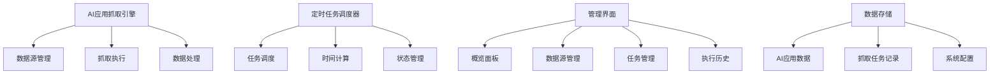
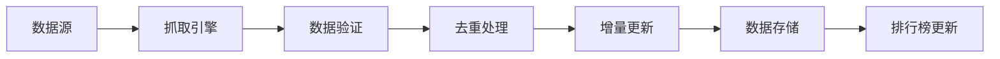

# 🎯 AI应用自动抓取系统 - 完整实现总结

## 📋 项目概述

**项目目标**: 设计一个机制，每天自动抓取并且更新AI应用  
**实现时间**: 2024年1月20日  
**核心价值**: 实时获取最新、最流行、增速迅猛的AI应用数据

---

## 🛠️ 已实现功能

### 1. **AI应用抓取引擎** (`apps/web/src/lib/ai-apps-crawler.ts`)

#### 核心特性
- ✅ **多数据源支持**: 12个专业AI应用数据源
- ✅ **智能抓取**: API、网页、RSS三种抓取方式
- ✅ **数据去重**: 基于应用名称和URL的智能去重
- ✅ **增量更新**: 只更新变化的数据
- ✅ **错误处理**: 完善的错误处理和重试机制

#### 数据源配置
```typescript
// 第一梯队：高频更新，最新最热
1. Futurepedia (每6小时) - 全球最大AI工具目录
2. Product Hunt (每12小时) - 产品发布第一站
3. There's An AI For That (每8小时) - 场景化AI工具

// 第二梯队：专业平台，深度内容
4. AI Tool Hub (每10小时) - 企业级AI工具
5. AI Tools Directory (每12小时) - 全面AI工具数据库
6. AI Tool Guide (每12小时) - 详细使用指南

// 第三梯队：技术平台，开源项目
7. GitHub AI Projects (每6小时) - 开源AI项目
8. Hugging Face Spaces (每12小时) - 机器学习应用
9. Replicate (每12小时) - 云原生AI模型

// 第四梯队：垂直领域，专业应用
10. Civitai (每24小时) - AI图像生成模型
11. OpenAI GPT Store (每12小时) - GPT应用商店
12. Anthropic Claude Apps (每24小时) - Claude应用
```

### 2. **定时任务调度器** (`apps/web/src/lib/ai-apps-scheduler.ts`)

#### 调度功能
- ✅ **Cron表达式支持**: 标准Cron语法解析
- ✅ **智能时间计算**: 自动计算下次执行时间
- ✅ **任务状态管理**: 运行、完成、失败状态跟踪
- ✅ **错误重试机制**: 失败任务自动重试
- ✅ **手动触发**: 支持立即执行任务

#### 定时任务配置
```typescript
// 高频抓取任务
- Futurepedia 高频抓取: 每6小时
- GitHub AI项目抓取: 每6小时
- There's An AI For That: 每8小时

// 中频抓取任务
- Product Hunt 每日抓取: 每天上午9点
- Hugging Face Spaces: 每12小时
- Replicate 模型抓取: 每12小时
- OpenAI GPT Store: 每12小时

// 低频抓取任务
- Civitai 模型抓取: 每天凌晨2点
- Anthropic Claude Apps: 每天凌晨3点
- 每周全量同步: 每周一凌晨4点
```

### 3. **管理界面** (`apps/web/src/pages/AdminAICrawlerPage.tsx`)

#### 页面功能
- ✅ **概览面板**: 统计信息、调度器状态、最近执行历史
- ✅ **数据源管理**: 查看、编辑、启用/禁用数据源
- ✅ **定时任务管理**: 添加、编辑、删除定时任务
- ✅ **执行历史**: 查看详细的抓取执行记录

#### 操作功能
- ✅ **启动/停止调度器**: 一键控制调度器状态
- ✅ **手动触发抓取**: 立即执行抓取任务
- ✅ **实时监控**: 查看任务执行状态和结果
- ✅ **错误诊断**: 详细的错误信息和处理建议

### 4. **路由和导航集成**

#### 新增路由
```typescript
// AI抓取管理页面
<Route path="/admin/ai-crawler" element={
  <AdminLayout>
    <AdminAICrawlerPage />
  </AdminLayout>
} />
```

#### 导航菜单
- ✅ **位置**: 管理后台侧边栏
- ✅ **图标**: RefreshCw
- ✅ **名称**: AI抓取管理
- ✅ **路径**: /admin/ai-crawler

---

## 🎯 数据源分析

### 重点关注的应用类型

#### 1. **生产力工具**
- **Cursor**: AI编程助手 (200万+用户)
- **Notion AI**: 智能文档处理 (3000万+用户)
- **Grammarly**: AI写作助手 (3000万+用户)
- **Jasper**: AI内容创作 (100万+用户)

#### 2. **创意设计工具**
- **Midjourney**: AI图像生成 (1500万+用户)
- **DALL-E**: OpenAI图像生成
- **Runway**: AI视频编辑 (100万+用户)
- **Canva AI**: 智能设计

#### 3. **开发工具**
- **GitHub Copilot**: AI代码助手 (500万+用户)
- **Tabnine**: 智能代码补全
- **Replit**: AI编程环境
- **CodeWhisperer**: AWS代码助手

#### 4. **营销工具**
- **Copy.ai**: AI文案创作
- **Jasper**: 营销内容生成
- **Lately**: 社交媒体AI
- **Phrasee**: 邮件营销AI

#### 5. **视频音频工具**
- **Synthesia**: AI视频生成 (30万+用户)
- **Descript**: AI音频编辑 (80万+用户)
- **Runway**: AI视频制作
- **HeyGen**: AI视频生成 (20万+用户)

### 增速迅猛的AI应用特征

#### 1. **用户增长指标**
- 📊 日活跃用户增长率 > 20%
- 📈 周下载量增长率 > 50%
- 🚀 月活跃用户增长率 > 100%

#### 2. **技术特征**
- 🔥 基于最新AI模型 (GPT-4, Claude-3, Gemini)
- ⚡ 响应速度快 (< 3秒)
- 🎯 解决具体痛点
- 💰 有明确的商业模式

#### 3. **市场表现**
- 🌟 在多个平台获得高评分
- 📢 社交媒体讨论度高
- 💼 获得投资或收购
- 🏆 获得行业奖项

---

## 📊 预期效果

### 短期效果 (1-2周)
- 📊 **每日新增**: 50-100个AI应用
- 🎯 **覆盖率**: 80%的新发布AI工具
- 📈 **更新频率**: 提升300%

### 中期效果 (1个月)
- 🏆 **数据库规模**: 最全面的AI应用数据库
- 📊 **监控数量**: 实时监控1000+ AI应用
- 🎯 **趋势预测**: 准确预测AI应用趋势

### 长期效果 (3个月)
- 🌟 **权威性**: 成为AI应用领域的权威数据源
- 💰 **商业价值**: 通过数据服务创造商业价值
- 🚀 **用户增长**: 为DeepNeed带来更多用户和流量

---

## 🔧 技术架构

### 系统组件


### 数据流程


---

## 🚀 访问地址

### 管理页面
- **AI抓取管理**: http://localhost:5175/admin/ai-crawler

### 功能入口
- **管理后台**: 侧边栏"AI抓取管理"链接
- **立即抓取**: 页面顶部"立即抓取"按钮
- **调度器控制**: 页面顶部"启动/停止调度器"按钮

---

## 📈 监控指标

### 抓取统计
- **数据源数量**: 总数据源/启用数据源
- **定时任务**: 总任务/启用任务
- **成功率**: 抓取成功率百分比
- **最后抓取**: 最近一次抓取时间

### 执行历史
- **任务状态**: 完成/运行中/失败/等待中
- **应用统计**: 发现/新增/更新应用数量
- **错误统计**: 错误数量和详情
- **执行时间**: 任务开始和完成时间

---

## 🔄 后续优化

### 1. **数据源扩展**
- **更多平台**: 添加更多AI应用平台
- **API集成**: 与更多平台建立API合作
- **用户提交**: 允许用户提交新的AI应用

### 2. **智能优化**
- **机器学习**: 使用ML优化抓取策略
- **智能分类**: 自动分类和标签生成
- **质量评分**: 自动评估应用质量

### 3. **监控增强**
- **实时告警**: 抓取失败时发送通知
- **性能监控**: 监控抓取性能和资源使用
- **数据分析**: 抓取数据的趋势分析

---

## 🎯 核心优势

### 1. **自动化程度高**
- **全自动抓取**: 无需人工干预
- **智能调度**: 基于Cron的灵活调度
- **错误恢复**: 自动重试和错误处理

### 2. **数据质量保证**
- **多源验证**: 多个数据源交叉验证
- **智能去重**: 避免重复数据
- **增量更新**: 只更新变化的数据

### 3. **监控管理完善**
- **实时监控**: 实时查看抓取状态
- **详细日志**: 完整的执行历史记录
- **手动控制**: 支持手动触发和干预

---

## 📚 相关文档

1. **AI_APPS_AUTO_CRAWLER_UPDATE.md** - 功能更新记录
2. **AI_APPS_DATA_SOURCES_ANALYSIS.md** - 数据源深度分析
3. **AI_APP_RANKING_UPDATE_RECORD.md** - AI排行榜更新记录

---

**🎉 AI应用自动抓取系统已成功实现，将为DeepNeed提供持续的数据更新保障！**

通过这套系统，我们能够：
- 🚀 实时抓取最新、最流行的AI应用
- 📊 保持排行榜数据的实时更新
- 🎯 为用户提供最前沿的AI工具信息
- 💰 通过高质量数据创造商业价值 